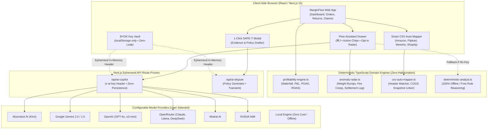

# AI Architecture & Capabilities Specification (`AI_INFRA.md`)

> **Live System Specification & Production Reference**  
> **System:** MarginFlow — Unified E-Commerce Financial Intelligence Platform  
> **Assistant Codename:** `Flow`  
> **Core Philosophy:** Frictionless, Deterministic, Zero-Math Hallucination, Zero Clutter  

---

## 1. System Architecture Overview

MarginFlow integrates AI into high-friction e-commerce workflows (reconciliation, ingestion, disputes, and anomaly audits) while strictly protecting financial accuracy through pre-computed deterministic domain engines.

---

## 2. The 3 Non-Negotiable Rules for Financial AI

Every AI capability in MarginFlow strictly adheres to these three product principles:

1. **Rule 1: Zero Hallucinated Math**  
   The LLM is **never** permitted to calculate raw financial math (sums, margins, deduction totals, POAS, or overcharges). All mathematics are deterministically pre-computed in TypeScript domain engines. The LLM only receives verified context and explains the numbers or drafts narratives.
2. **Rule 2: Action Chips Over Long Essays**  
   Operators do not read walls of conversational text. Responses are concise and include clickable **Interactive Action Chips** (`[Inspect ELEC-ANC-EB ➔]`, `[⚡ Draft SAFE-T Claim]`, `[Filter Flipkart]`) that mutate filters or open drawers with a single click.
3. **Rule 3: Optimistic UI & Ambient Opt-In (Zero Clutter)**  
   No heavy, intrusive banners cluttering the main dashboard. Advanced audits (like the Anomaly Radar) run quietly and surface discrete opt-in prompts inside Flow. If the user wants details, they click `[View]`; if dismissed, the UI stays completely clean.

---

## 3. Live AI Capabilities Inventory

### A. The "Flow" Assistant Drawer (`cfo-copilot.tsx`)
- **Invocation:** Click "Flow" in the top navigation bar or press `⌘J` / `Ctrl+J`.
- **Capabilities:**
  - **P&L Variance Diagnosis:** Breaks down exact drivers behind profit drops (e.g., return freight surges, COGS inflation, or marketplace fee hikes).
  - **POAS vs. ROAS Ad Bleed Audit:** Identifies SKUs showing high ROAS on paper that actually lose money due to return rates and marketplace deductions.
  - **Overdue Settlement Aging:** Flags orders delivered past 14 days without bank credit reconciliation.
  - **Returns & RTO Drivers:** Pinpoints loss-making return categories and highlights claim deadlines.
  - **Context Grounding:** Reads current store filters (selected marketplace, active date range) without manual prompt input.

### B. On-Demand Operational Anomaly Radar (`anomaly-radar.ts`)
- **Philosophy:** Runs deterministically in the background; presented inside Flow as an opt-in prompt (`⚡ 2 anomalies detected. View details? [View] [Dismiss]`).
- **Core Detectors:**
  1. **Courier Volumetric Weight Overcharges:** Cross-references catalog dead weights against carrier freight bills. Flags sub-500g parcels billed above rate slabs ($>\text{₹}80$), calculating exact excess freight at risk.
  2. **Marketplace Commission Fee Creep:** Identifies orders where actual platform deductions exceed standard rate cards by $>15\%$ relative.
  3. **High-Return / RTO Bleed:** Detects SKUs with $>20\%$ return rates eroding contribution margin through return shipping and customer return fees.
  4. **Disbursement Aging Lag:** Tracks delivered orders older than 14 days with missing bank settlement credits.
- **Output:** Exact quantified rupee impact + direct action chips to navigate to Claims, Settlements, or Returns.

### C. 1-Click SAFE-T & Return Dispute Generator (`dispute-packet-modal.tsx`)
- **Trigger:** Accessible directly from any damaged return row in the Returns or Claims modules.
- **Workflow:**
  1. Captures order ID, channel reference, return type, tracking AWB, and catalog cost snapshot (`snapshotUnitCost`).
  2. Synthesizes a formal claim narrative citing Amazon India SAFE-T policy or Flipkart Seller Protection SLAs.
  3. Itemizes financial loss: Product Wholesale Cost + Forward Shipping + Reverse Freight − Salvage Value.
  4. Provides a required photographic evidence checklist and an instant `[Copy Claim Text]` button.

### D. Smart CSV Auto-Mapper (`csv-auto-mapper.ts` + `csv-import-modal.tsx`)
- **Supported Formats:**
  - **Amazon MTR (Merchant Tax Report)** (`asin`, `seller-sku`, `order-id`, `item-price`, `ship-city`)
  - **Flipkart Order Export** (`fsn`, `sub_order_id`, `final_sale_amount`, `order_state`)
  - **Meesho Supplier Sheet** (`sub order no`, `supplier discounted price`, `packet id`, `meesho`)
  - **Shopify Orders Export** (`lineitem sku`, `financial status`, `billing name`)
  - **Generic ERP CSVs**
- **Capabilities:**
  - Auto-skips non-header metadata/title rows (scans top 8 rows for header density).
  - Normalizes currencies (`₹`, `,`, negative brackets `(50.00)` $\rightarrow$ `-50`) and standardizes dates to `YYYY-MM-DD`.
  - Links channel aliases (`B08WEM01-IND`, `FLIP-MOUSE-WEM`, `MSHO-98311-MSE`) to master catalog items, locking historical `snapshotUnitCost` at ingest time.
  - Dual-view modal: "Normalized Orders Preview" and "Auto-Mapped Columns Breakdown" with confidence scoring.

### E. Multi-Provider BYOK Key Vault (`ai-vault.ts` + `ai-settings-modal.tsx`)
- **Zero-Knowledge Security:** All API keys are stored exclusively in the user's browser `localStorage`. No keys are ever written to the platform database or persisted in server logs.
- **Supported Providers:**
  - **Moonshot AI (Kimi)** (`moonshot-v1-8k`, `moonshot-v1-32k`)
  - **Google Gemini** (`gemini-2.0-flash`, `gemini-1.5-flash`)
  - **OpenAI** (`gpt-4o`, `gpt-4o-mini`, `o3-mini`)
  - **OpenRouter** (`anthropic/claude-3.5-sonnet`, `meta-llama/llama-3.3-70b-instruct`, `deepseek/deepseek-r1`)
  - **Mistral AI** (`mistral-small-latest`, `mistral-large-latest`)
  - **NVIDIA NIM** (`meta/llama-3.1-70b-instruct`)
  - **Custom Base URL** (for self-hosted vLLM or Ollama endpoints)
  - **Local Deterministic Fallback** (runs 100% offline with zero cost if no key is configured)

---

## 4. How AI Boosts Seller Productivity

| Task | Traditional Manual Process | MarginFlow AI Process | Productivity Gain |
| :--- | :--- | :--- | :--- |
| **Marketplace CSV Import** | Download 3 separate sheets; manually rename 15+ headers in Excel; match SKUs manually. (30–45 mins) | Drag & drop raw sheet; auto-detects format, auto-maps columns, and locks COGS. (< 3 secs) | **~90% time saved** on data entry |
| **SAFE-T Dispute Filing** | Lookup return ticket; calculate net unit loss; draft formal policy email to Amazon/Flipkart. (15–20 mins) | Click `[⚡ Draft SAFE-T Claim]`; packet is pre-filled with policy citations and loss math. (30 secs) | **Eliminates 15 mins/ticket**, stops lost revenue |
| **P&L Anomaly Auditing** | Export orders; build pivot tables to find why margin slipped or which ad campaign is bleeding. (2–3 hours) | Ask Flow: *"Why did profit drop?"* or click on-demand Anomaly Radar prompt. (Instant) | **Instant financial clarity**, zero spreadsheet work |
| **Courier Freight Auditing** | Cross-reference carrier weight slabs against actual product dimensions on hundreds of orders. | Anomaly Radar automatically flags sub-500g parcels charged on heavy freight tiers. | **Recovers ₹1,000s in silent freight leakage** |

---

## 5. Codebase Mapping & Implementation Files

| Component / Layer | Primary Source File(s) | Responsibility |
| :--- | :--- | :--- |
| **Copilot Drawer** | [`src/components/ai/cfo-copilot.tsx`](file:///c:/Users/freak/Desktop/Unified%20platform/src/components/ai/cfo-copilot.tsx) | Minimalist assistant drawer, action chip dispatch, opt-in prompt |
| **BYOK Security Vault** | [`src/lib/security/ai-vault.ts`](file:///c:/Users/freak/Desktop/Unified%20platform/src/lib/security/ai-vault.ts) | Client-side key encryption, provider registry, secure headers |
| **AI Settings Modal** | [`src/components/ai/ai-settings-modal.tsx`](file:///c:/Users/freak/Desktop/Unified%20platform/src/components/ai/ai-settings-modal.tsx) | Provider & model selector UI (Moonshot, Gemini, OpenAI, etc.) |
| **Dispute Modal** | [`src/components/modals/dispute-packet-modal.tsx`](file:///c:/Users/freak/Desktop/Unified%20platform/src/components/modals/dispute-packet-modal.tsx) | 1-Click SAFE-T dispute packet preview & copy drawer |
| **CSV Auto-Mapper Engine**| [`src/domain/csv-auto-mapper.ts`](file:///c:/Users/freak/Desktop/Unified%20platform/src/domain/csv-auto-mapper.ts) | Multi-format detection, header scoring, catalog COGS locking |
| **CSV Import Modal** | [`src/components/modals/csv-import-modal.tsx`](file:///c:/Users/freak/Desktop/Unified%20platform/src/components/modals/csv-import-modal.tsx) | Drag-drop upload UI, preview table, column mapping inspection |
| **Anomaly Radar Engine** | [`src/domain/anomaly-radar.ts`](file:///c:/Users/freak/Desktop/Unified%20platform/src/domain/anomaly-radar.ts) | Deterministic math for weight overcharges, fee creep, and lag |
| **Copilot API Proxy** | [`src/app/api/ai-copilot/route.ts`](file:///c:/Users/freak/Desktop/Unified%20platform/src/app/api/ai-copilot/route.ts) | Ephemeral proxy injecting grounded context into LLM providers |
| **Dispute API Proxy** | [`src/app/api/ai-dispute/route.ts`](file:///c:/Users/freak/Desktop/Unified%20platform/src/app/api/ai-dispute/route.ts) | Ephemeral proxy generating policy-compliant claim narratives |
| **Local Deterministic AI**| [`src/domain/deterministic-analyst.ts`](file:///c:/Users/freak/Desktop/Unified%20platform/src/domain/deterministic-analyst.ts) | Zero-cost, zero-API-key local offline reasoning engine |
