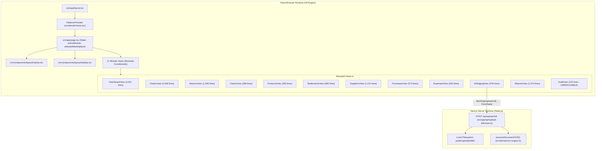
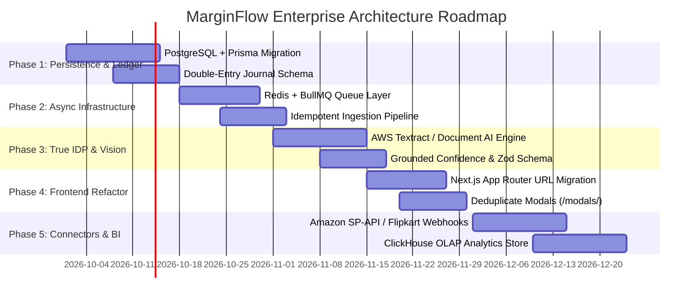

# MarginFlow — Deep Architectural, Orchestration & Logic Audit

> **Target System:** Unified E-Commerce Financial Intelligence Platform (`MarginFlow`)  
> **Workspace:** `c:/Users/freak/Desktop/Unified platform`  
> **Audit Date:** 2026-09-17  
> **Audit Method:** Multi-Agent Deep Codebase Inspection (Domain Logic, UI Duplication, and Infrastructure/Ingestion Engines)  
> **Output Document:** `analyzeproblems.md`

---

## 1. Executive Summary

MarginFlow is designed as a transaction-level financial intelligence engine for multi-channel e-commerce merchants operating across **Amazon India**, **Flipkart**, **Meesho**, and **Personal Website (D2C)**. Its stated goal is to replace vanity Gross Merchandise Value (GMV) metrics with true unit economics (Net Revenue $\rightarrow$ COGS $\rightarrow$ Contribution Margin $\rightarrow$ Net Operating Profit), protected by deterministic invariants.

However, a deep forensic audit of the codebase reveals **three critical structural disconnects**:

1. **Architecture & Persistence Gap:** While the project documentation (`AI_INFRA.md`, `workflow.md`, `Features.md`) specifies an immutable 7-partition ledger, multimodal vision OCR, automated SAFE-T dispute drafting, and marketplace API ingestion, the actual codebase is a **100% client-side React prototype running entirely in browser volatile RAM**. There is no database, no message queue, no real OCR engine, no CSV file parser, and no external API/webhook connectors. All data is reset on browser refresh.
2. **Presentation Layer Bloat & Extreme Duplication:** The frontend functions as a monolithic Single Page Application (SPA) driven by string state in `src/app/page.tsx`. Two view files alone account for nearly **6,000 lines of code** (`dashboard-view.tsx` at 3,251 lines and `orders-view.tsx` at 2,646 lines). Over **1,800 lines of modal forms and business math are duplicated verbatim** between components, global marketplace filters are shadowed or ignored, and entire modules (such as `AuditView`) are orphaned and unreachable in the UI.
3. **Severe Financial Calculation Invariants Flaws:** In the calculation engine (`profitability-engine.ts`), return shipping and logistics costs are **double- and triple-counted**, item costs for damaged returns are **double-deducted** from both Gross Profit and Contribution Margin, marketplace fee estimations are wiped out due to an **all-or-nothing settlement fallback collapse**, and statutory tax guardrails (P6) are **100% hardcoded mocks** that count GST output tax as seller profit.

---

## 2. End-to-End Workflow & Component Interconnectivity

### 2.1 The Application Runtime Topology

The current application operates as a client-heavy, single-route Next.js application:



### 2.2 Navigation Orchestration Layer

Navigation is orchestrated inside `src/app/page.tsx` via two in-memory React state hooks:
```tsx
// src/app/page.tsx (lines 21-23)
const [activeModule, setActiveModule] = useState<NavModule>("dashboard");
const [selectedMarketplace, setSelectedMarketplace] = useState<Marketplace | "ALL">("ALL");
```

#### Architectural Deficiencies in Navigation:
1. **Zero Deep Linking or URL State:** The browser URL remains stuck at `http://localhost:3000/`. Reloading the page immediately resets `activeModule` back to `"dashboard"`, wiping any active sub-tab, open modal, pagination page, or search query. Users cannot bookmark or share links to orders, reports, or supplier details.
2. **Broken Browser History:** Clicking the browser "Back" or "Forward" buttons exits the web application entirely rather than transitioning between modules.
3. **Bundle Size & No Code Splitting:** All 11 module views are statically imported at the top of `src/app/page.tsx` (lines 4–17). The client must download and parse the JavaScript for every single module before first render, leading to slow Initial Server Response and high Time-to-Interactive (TTI).

---

### 2.3 State Flow & The 7 Domain Partitions

All state originates in `src/domain/store.tsx` via `PlatformProvider`, which exposes a single React Context (`usePlatform()`):

```
┌────────────────────────────────────────────────────────────────────────────────────────────────────────┐
│                                         PlatformProvider (store.tsx)                                   │
│  State: [products] [orders] [returns] [settlements] [claims] [suppliers] [purchases] [expenses]       │
│         [aiDocuments] [auditLogs]                                                                      │
└───────┬──────────────┬──────────────┬──────────────────┬──────────────┬──────────────┬─────────────────┘
        │              │              │                  │              │              │
        ▼              ▼              ▼                  ▼              ▼              ▼
   Partition 1    Partition 2    Partition 3        Partition 4    Partition 5    Partition 6
     Catalog         Orders         Returns         Settlements        Claims       Procurement
  & Cost Basis   & Line Items     & Dispositions     & Deductions   & Recoveries   & OPEX Ledgers
  (products.ts)   (orders.ts)    (ReturnRecord.ts)  (Settlement.ts)   (Claim.ts)   (purchases/exp.)
        │              │              │                  │              │              │
        └──────────────┴──────────────┴──────────────────┴──────────────┴──────────────┘
                                              │
                        ┌─────────────────────┴─────────────────────┐
                        ▼                                           ▼
             Profitability Engine                       Guardrails Engine
          (profitability-engine.ts)                      (guardrails.ts)
          - Business Profitability                       - Invariant Diagnostics (P1–P7)
          - Marketplace Profitability                    - AI Document Arithmetic
          - SKU & Aging Profitability
```

#### State Desynchronization Across Views:
1. **Date Filter Asymmetry:**
   - In `store.tsx`, date filtering (`filterDatasetByDateRange`) is applied to derived aggregates: `profitability`, `marketplaceBreakdown`, and `skuBreakdown`.
   - However, raw arrays (`orders`, `returns`, `settlements`) are exposed to consumers **completely unfiltered by date**.
   - As a result, in `OrdersView` and `ReturnsView`, users see all-time historical tables, while the KPI cards on `DashboardView` and `ReportsView` show date-windowed totals. Numbers between top cards and bottom tables contradict each other.
   - Date preset controls (`setDatePreset`) exist **only** on `DashboardView`. When an operator changes the date preset on the Dashboard, it silently mutates the `profitability` metrics used in `ReportsView` without any indication in `ReportsView` that a date filter is active.
2. **Channel Filter Collisions & Shadowing:**
   - `selectedMarketplace` is maintained in `page.tsx` and passed to `Navbar` and 5 views.
   - **`OrdersView` Conflict:** `selectedMarketplace` is received as `globalMarketplace` (`orders-view.tsx:638`), but `OrdersView` also maintains a local `platformFilter` dropdown (`line 659`). The filtering logic (`lines 937–948`) attempts to enforce both simultaneously. If a user selects "Amazon India" in the top navbar and "Flipkart" in the Orders dropdown, 0 results are returned without explanation.
   - **`ReturnsView` Shadowing:** `ReturnsView` initializes a local state `localMarketplace` (`returns-view.tsx:61–63`). Once a user selects a channel from the Returns dropdown, the global top navbar channel selector is completely disconnected and ignored.
   - **`ReportsView` Ignorance:** `selectedMarketplace` is not even passed to `ReportsView`. `ReportsView` maintains its own `selectedChannel` state (`line 54`), completely decoupled from the rest of the application.

---

## 3. Financial Logic & Domain Invariant Flaws

### 3.1 Return Loss Double-Counting & Salvage Distortion
In `src/domain/profitability-engine.ts` (`calculateBusinessProfitability`, lines 164–180):
```typescript
returns.forEach((ret) => {
  totalReturnedUnits += ret.quantity;
  const loss = ret.lossAmount + ret.returnShippingCost + ret.otherReturnCosts; // Line 166

  if (ret.returnType === "RTO") {
    rtoLosses += loss;
  } else {
    returnLosses += loss;
  }
});
```

#### The Bugs:
1. **Double-Counting Return Freight:** In `mock-data.ts` and standard logistics records, `ReturnRecord.lossAmount` **already includes** reverse shipping and handling fees:
   - For `RET-201` (`mock-data.ts:483–486`): `returnShippingCost: 55`, `otherReturnCosts: 10`, `lossAmount: 65`. The formula calculates:
     $$\text{loss} = 65 + 55 + 10 = 130 \quad (\text{Freight \& fees added twice!})$$
   - For `RET-202` (`mock-data.ts:505–508`): `lossAmount: 825` was formulated as $(\text{Unit Cost ₹840} - \text{Salvage ₹100}) + \text{Shipping ₹85} = ₹825$. The engine calculates:
     $$\text{loss} = 825 + 85 + 15 = 925 \quad (\text{Shipping added twice, scrap recovery distorted})$$
2. **Double-Deduction of Product COGS on Damaged Returns:**
   - In `profitability-engine.ts:139–144`, COGS is deducted for all non-cancelled orders:
     $$\text{Gross Profit} = \text{Net Sales} - \text{Locked COGS}$$
   - On a damaged return, the customer is refunded, but the damaged product cost is **also** included inside `ret.lossAmount` and deducted again in Contribution Profit:
     $$\text{Contribution Profit} = \text{Gross Profit} - \text{Charges} - (\text{returnLosses} + \text{rtoLosses}) + \dots$$
   - Result: The cost of the damaged inventory is deducted **twice** from the business bottom line.
3. **No Revenue Reversal on Sellable Returns:**
   - When an item is returned in `SELLABLE` condition (e.g. unopened RTO or buyer remorse), customer refunds are issued.
   - However, `netSales` is **never decremented**. The engine counts 100% of the customer's gross payment as sales revenue while charging the business for return logistics.

---

### 3.2 The Settlement Deduction Collapse Bug
In `src/domain/profitability-engine.ts:195–216`:
```typescript
let actualSettlementDeductions = 0;
settlements.forEach((s) => {
  actualSettlementsReceived += s.netSettlement;
  s.deductions.forEach((d) => {
    actualSettlementDeductions += d.amount;
  });
});

// Line 207: Fatal aggregation collapse
const finalCharges = actualSettlementDeductions > 0 ? actualSettlementDeductions : marketplaceCharges;

const contributionProfit =
  grossProfit -
  finalCharges -
  shippingLogisticsCosts -
  (returnLosses + rtoLosses) +
  claimRecoveries;
```

#### The Disaster:
- If a seller has **100 orders** with an estimated ₹25,000 in marketplace commissions, and the seller imports a settlement batch for **just 1 order** with ₹250 in actual fees, `actualSettlementDeductions > 0` evaluates to `true`.
- The engine sets `finalCharges = 250` and **completely discards the ₹24,750 estimated commissions for the remaining 99 unsettled orders!**
- Profitability and Net Margin are wildly and artificially inflated.

#### Engine-to-Engine Inconsistency:
- In `calculateMarketplaceProfitability` (`profitability-engine.ts:393`), deductions are filtered: `d.category !== "LOGISTICS"`.
- But in `calculateBusinessProfitability` (`line 201`), logistics deductions are **not** filtered.
- Consequently, **Business Contribution Profit never matches the sum of Marketplace Contribution Profits**.

---

### 3.3 Tax Invariant Mocking (P6 Guardrail)
`GUARDRAILS.md` and `workflow.md` claim that Guardrail P6 strictly isolates GST, TCS, and TDS liabilities from operating expenses. In reality, `src/domain/guardrails.ts` (lines 130–137) contains:
```typescript
// P6 Guardrail: Tax Separation from Operating Expenses
results.push({
  partition: "P6: Profitability Ledger",
  name: "Tax Liability Isolation",
  status: "HEALTHY",
  details: "TCS, TDS, and GST are isolated in tax ledgers and barred from OPEX dilution.",
  count: 0,
});
```
- **This guardrail is a 100% hardcoded mock.** No validation logic is executed.
- In `mock-data.ts:798–801`, selling prices include 18% IGST (₹129.50 on ₹849 total). The engine calculates `netSales = grossSales - discounts` (₹849). **Government tax revenue is treated as seller income and counted toward net operating profit.**
- There is no Input Tax Credit (ITC) ledger to offset GST paid on supplier purchases (`PurchaseBill.taxes`) against GST collected on orders.

---

### 3.4 Temporal Cash vs. Accrual Disconnect
In `filterDatasetByDateRange` (`profitability-engine.ts:647–661`):
- Orders are filtered by `orderDate`.
- Returns are filtered by `returnDate`.
- Claims are filtered by `claimDate` (ignoring `recoveryDate`).
- Settlements are filtered by `settlementDate`.

**Real-world failure case:**
- An order placed on **August 28** is returned damaged on **September 3**.
- In **August P&L**: Shows full revenue (+₹1,500), full COGS (-₹600), and ₹0 return loss. Profit is inflated to +₹900.
- In **September P&L**: Shows ₹0 revenue, ₹0 COGS, and -₹750 in return loss. Profit for this customer is reported as -₹750.
- Claims recovered in September for claims filed in August are omitted from September P&L because the engine filters on `claimDate` instead of `recoveryDate` (`line 652`).

---

### 3.5 Broken State Cascades & Orphaned Records

| Action | Code Location | Flaw |
| :--- | :--- | :--- |
| `addOrder` | `store.tsx:219–233` | No idempotency check. Inserting duplicate `(marketplace, channelOrderId)` duplicates ledger revenue. Does not validate `snapshotUnitCost` against `products`. |
| `addReturn` | `store.tsx:357–369` | Hardcodes `order.status = "PARTIALLY_RETURNED"` (`line 363`). An order with 100% of items returned can never reach `RETURNED`. Never increments `item.returnedQuantity`. |
| `deleteReturn` | `store.tsx:428–448` | Removes the return ID from `order.returnIds`, but **never restores `order.status`** back to `DELIVERED`. The order remains permanently stuck in `PARTIALLY_RETURNED` or `RTO`. |
| `restockReturn` | `store.tsx:401–413` | Sets `condition = "SELLABLE"` and `restockStatus = "RESTOCKED"`. **Phantom Restock:** `Product` has no inventory count field; stock is never replenished and COGS write-off is never reversed. |
| `deleteOrder` | `store.tsx:276–293` | Cascading delete purges settled bank remittances (`settlements`) and active dispute claims (`claims`). Accounting records cannot be deleted when an order is cancelled. |
| `recordSupplierPayment` | `store.tsx:586–617` | Increments `supplier.totalPaid`, but does not link to any `PurchaseBill`. Bills remain perpetually marked as `PENDING`. |

---

## 4. Frontend Architecture, Bloat & Code Duplication

### 4.1 Mega-Component (God View) File Bloat

The presentation layer violates the Single Responsibility Principle:

```
dashboard-view.tsx (3,251 lines) Structure:
├── FormMarketplaceDropdown & Palettes: ~180 lines (79-249)
├── Local State & 3 Modal Handlers: ~325 lines (291-606)
├── Custom Date Popover & Math: ~180 lines (704-783)
├── Static Metric Modal Dictionaries: ~180 lines (784-960)
├── KPI Metric Cards Grid (CFO vs Operator): ~530 lines (1141-1670)
├── Channel Charts (Recharts containers): ~155 lines (1671-1825)
├── SKU Economics Table (Custom inline <table>): ~490 lines (1826-2315)
├── SKU Detail Slide-over Drawer: ~165 lines (2316-2480)
├── Add Order Modal (VERBATIM DUPLICATE): ~435 lines (2521-2956)
├── Record Return Modal (VERBATIM DUPLICATE): ~150 lines (2957-3104)
└── Record Purchase Modal (VERBATIM DUPLICATE): ~145 lines (3105-3250)

orders-view.tsx (2,646 lines) Structure:
├── Platform & Status Badges: ~120 lines (56-178)
├── Custom Filter Dropdowns: ~300 lines (179-480)
├── Duplicate FormMarketplaceDropdown: ~150 lines (481-634)
├── Custom Orders Table (Custom inline <table>): ~415 lines (1380-1793)
├── Add Order Modal (VERBATIM DUPLICATE): ~466 lines (1794-2260)
├── Edit Order Modal: ~140 lines (2261-2400)
├── Order Detail Drawer: ~150 lines (2401-2550)
├── Delete Confirmation Modal: ~50 lines (2551-2601)
└── Channel CSV Ingestion Modal (Mock): ~45 lines (2602-2646)
```

---

### 4.2 Verbatim Duplicated Modals & Components

#### 1. Add Order Modal (465-line duplicate)
- **Files:** `dashboard-view.tsx:2521–2956` and `orders-view.tsx:1794–2260`
- **Duplication:** Both files declare the exact same 19 state hooks (`formMarketplace`, `formOrderId`, `formSku`, `formQuantity`, `formUnitCost`, `formSellingPrice`, etc.), identical 15% marketplace commission estimation math, identical subtotal calculations, and identical 3-section JSX forms (Platform, Product, Return & Claim Accordion).

#### 2. Record Return Modal (150-line duplicate)
- **Files:** `dashboard-view.tsx:2957–3104` and `returns-view.tsx:895–1080`
- **Duplication:** Duplicate order pickers, return condition selectors (`SELLABLE`, `DAMAGED`), freight input, and automatic claim creation handlers.

#### 3. Record Purchase Bill Modal (140-line duplicate)
- **Files:** `dashboard-view.tsx:3105–3250` and `purchases-view.tsx:149–270`
- **Duplication:** Duplicate vendor dropdowns, SKU selectors, quantity/cost inputs, and 18% GST tax calculation.

#### 4. Add vs. Edit Supplier Modal (330-line duplicate within the same file)
- **File:** `suppliers-view.tsx:580–748` (Add Modal) vs. `suppliers-view.tsx:753–910` (Edit Modal)
- **Duplication:** 95% identical form JSX repeating 10 identical inputs (name, contact person, phone, email, GSTIN, payment terms, bank account, UPI ID, warehouse address, notes).

#### 5. Channel Selectors & Dropdowns (5 independent copies)
- `navbar.tsx:54–72` (Pill segmented control)
- `reports-view.tsx:375–395` (Pill segmented control)
- `orders-view.tsx:188–250` (`EnhancedPlatformDropdown`)
- `dashboard-view.tsx:79–249` (`FormMarketplaceDropdown`)
- `orders-view.tsx:481–634` (Duplicate `FormMarketplaceDropdown`)

---

### 4.3 UI Bypassing the Domain Profitability Engine

Multiple views bypass `profitability-engine.ts` and re-compute metrics using inline `.reduce()` loops:
- `returns-view.tsx:144–174`: Re-calculates `totalReturnLoss`, `totalReturnUnits`, and `rtoStats` from raw arrays, ignoring the engine's `ProfitabilityMetrics`.
- `reports-view.tsx:73–87, 140–155`: Manually re-computes customer return counts, RTO rates, and channel return percentages.
- `claims-view.tsx:40–43`: Re-calculates `totalClaimed`, `totalRecovered`, and `outstandingAmount`.
- `suppliers-view.tsx:106–107`: Embeds fragile, hardcoded domain heuristics directly in the UI:
  ```tsx
  const isMatch =
    o.notes?.includes(sup.name) ||
    (sup.id === "SUP-001" && item.sku.startsWith("ELEC-WEM")) ||
    (sup.id === "SUP-002" && item.sku.startsWith("ELEC-USBC"));
  ```

---

## 5. Irrelevant, Dead, Phantom & Orphaned Parts

### 5.1 The Orphan View: `AuditView` (`src/components/modules/audit-view.tsx`)
- **Status:** **Completely unreachable and dead in the running application.**
- **Details:**
  - `src/app/page.tsx` imports `AuditView` (line 17) and conditionally mounts `{activeModule === "audit" && <AuditView />}` (line 92).
  - `src/components/layout/sidebar.tsx` defines `"audit"` in `NavModule` (line 34).
  - `src/domain/store.tsx` actively logs hundreds of audit events (`auditLogs`).
  - **However, in `src/components/layout/sidebar.tsx` (lines 53–132), the `navItems` array completely omits `"audit"`.**
  - No button or link anywhere in the web app sets `activeModule = "audit"`. The entire audit trail interface is inaccessible to users.

### 5.2 Fake CSV Ingestion in `OrdersView`
- `orders-view.tsx:2602–2642` renders an "Import CSV" modal advertising automated column normalization for Amazon, Flipkart, Meesho, Myntra, and WooCommerce.
- Clicking any channel does **not** open a file picker or parse CSV data. It calls `handleSampleCsvImport` (`lines 1203–1232`), which inserts a single hardcoded mock order (`ORD-CSV-${batchId}`) with fixed values (`"Pune"`, `"Maharashtra"`, SKU `"ELEC-USBC-65W"`).
- There is no CSV parsing engine (`PapaParse`, `csv-parse`) in the application.

### 5.3 Defective `searchKey` in `DataTable` (`src/components/ui/data-table.tsx`)
- Line 26 defines `searchKey?: string;`.
- Line 54 checks `{searchKey && ( ... )}` strictly as a boolean toggle to display an input box.
- The input handler (`line 59`) calls `setGlobalFilter(event.target.value)`.
- The `searchKey` parameter is **never used to filter by column**; it performs a global full-text search across all columns regardless of the prop passed.

### 5.4 Missing Navbar Title for Purchases
- In `src/components/layout/navbar.tsx` (lines 28–40), `moduleTitles` defines titles for 11 modules but omits `"purchases"`.
- Navigating to Purchases displays the unformatted raw string `"purchases"` in the header breadcrumb.

---

## 6. Infrastructure & Backend Ingestion Audit

### 6.1 Documentation Claims vs. Codebase Reality

| Capability | Documented Specification | Codebase Reality | Status |
| :--- | :--- | :--- | :--- |
| **Database Persistence** | Transaction-level ledger with immutable audit trail (`workflow.md` §2). | 100% in-memory React `useState` (`store.tsx:120–127`). Zero database. Page refresh destroys all data. | **Missing** |
| **Marketplace APIs** | Ingestion from Amazon MWS/SP-API, Flipkart, Meesho (`workflow.md` L26–32). | Zero external API connectors, OAuth tokens, or webhooks. | **Missing** |
| **Vision OCR Engine** | Multimodal Vision OCR and Intelligent Document Processing (`AI_INFRA.md` §2). | `buffer.toString("utf-8")` (`route.ts:38`). No OCR library. Binary PDFs fall back to hardcoded mock text. | **Simulated** |
| **CFO AI Copilot** | Conversational Q&A assistant ("Chat With Your P&L") (`AI_INFRA.md` §2 Impl 1). | Completely absent. No copilot component, no LLM SDK (`openai`, `@google/genai`) installed. | **Missing** |
| **Anomaly Radar** | Autonomous background fee creep and margin leakage monitor (`AI_INFRA.md` §2 Impl 2). | Absent as an autonomous engine. Only basic static UI alerts exist. | **Missing** |
| **One-Click SAFE-T Generator** | Auto-compiles carrier proof, policy checks, and claim text (`AI_INFRA.md` §2 Impl 3). | Absent. `claims-view.tsx` only renders a manual data table and cash recovery input modal. | **Missing** |
| **Predictive Restock Advisor** | Run-rate velocity and Days of Inventory Remaining (`AI_INFRA.md` §2 Impl 4). | Absent. Product catalog only displays static cost history. | **Missing** |
| **Arithmetic Guardrail (P7)** | Invariant check: $\text{Qty} \times \text{Price} - \text{Disc} + \text{Tax} \equiv \text{Total}$ (`GUARDRAILS.md`). | When regex fails to match a total, `declaredTotal` is calculated as `subtotal + tax`, guaranteeing a 100% pass. | **Bypassed** |

---

### 6.2 Security & Scalability Vulnerabilities in `/api/upload-bill/route.ts`

```typescript
// src/app/api/upload-bill/route.ts (lines 19-33)
const bytes = await file.arrayBuffer();
const buffer = Buffer.from(bytes);

const uploadsDir = path.join(process.cwd(), "public", "uploads", "bills");
await fs.mkdir(uploadsDir, { recursive: true });

const safeTimestamp = Date.now();
const sanitizedOriginalName = file.name.replace(/[^a-zA-Z0-9.-]/g, "_");
const savedFileName = `${safeTimestamp}-${sanitizedOriginalName}`;
const destinationPath = path.join(uploadsDir, savedFileName);

await fs.writeFile(destinationPath, buffer);
```

#### Vulnerabilities:
1. **Denial of Service (DoS) via Unbounded Heap Memory:** Neither `route.ts` nor `next.config.mjs` configures maximum request payload limits. Uploading large files buffers the entire file twice in V8 heap memory (`arrayBuffer` and `Buffer.from`), triggering Out-Of-Memory (`SIGSEGV` or `heap out of memory`) crashes.
2. **Arbitrary File Upload into Public Web Root:** Files are written directly to `public/uploads/bills/`. Next.js serves the `public/` directory statically without authentication. Anyone can access uploaded supplier bills, bank statements, or uploaded executable/HTML/SVG payloads directly at `https://<domain>/uploads/bills/<file>`.
3. **Stateless / Serverless Incompatibility:** Writing to `process.cwd()/public` assumes a persistent local disk. In standard Next.js deployments (Vercel, AWS Lambda, Google Cloud Run), the root filesystem is read-only or ephemeral. Uploads will fail with `EROFS` or disappear when instances cycle.

---

### 6.3 Forensic Analysis of `src/domain/ocr-engine.ts`

1. **Binary Document Destruction:** In `route.ts:38`, `buffer.toString("utf-8")` turns binary PDFs and JPEG/PNG scans into invalid UTF-8 strings. Line 41 flags `nonPrintableCount > 20` and replaces the text with:
   `[Binary Document Scan - invoice.pdf]\nFile Size: 145.2 KB\nUploaded: 9/17/2026, 6:00:00 PM`
2. **Hardcoded Fallbacks:** Because `[Binary Document Scan...]` contains no readable invoice text, every regex in `ocr-engine.ts` fails, triggering hardcoded defaults:
   - Invoice Number (`line 39`): `BILL-${Math.floor(100000 + Math.random() * 900000)}`
   - Vendor Name (`line 69`): `"Apex Components Ltd"`
   - SKU (`line 75`): `"ELEC-WEM-01"`
   - Product Name (`line 80`): `"Wireless Ergonomic Mouse"`
   - Quantity (`line 86`): `10`
   - Unit Price (`line 92`): `380`
   - Tax Amount (`line 102`): `subtotal * 0.18` (₹684)
3. **Fabricated Confidences:** Despite reading zero characters from the uploaded bill, the engine returns hardcoded confidence scores:
   - `quantity.confidence: 0.99`, `totalAmount.confidence: 0.99`, `invoiceNumber.confidence: 0.98`
   - Fake raw preview (`line 238`): `"[OCR Verification: Engine v2.4 Multi-pass Complete]"`
4. **Tautological Arithmetic Pass:** In `ocr-engine.ts:108`:
   ```typescript
   const declaredTotal = totalMatch ? parseFloat(...) : (subtotal + taxAmount);
   ```
   Because `totalMatch` always fails on binary files, `declaredTotal` is set to `subtotal + taxAmount`. When `validateDocumentArithmetic()` tests $\text{Calculated} - \text{Declared}$, the difference is identically `0.00`, allowing fake documents to pass the quarantine guardrail without error.

---

## 7. Strategic Engineering Improvement Roadmap

To transition MarginFlow from an in-memory frontend prototype into a fault-tolerant, enterprise-grade financial ERP, execute this 5-phase engineering roadmap:



### Phase 1: Relational Persistence & Double-Entry Ledger (Weeks 1–2)
1. **Initialize Database (PostgreSQL + Prisma ORM):**
   - Replace in-memory React state with a relational database.
   - Use `DECIMAL(12, 2)` or integer minor units (paise/cents) for all monetary values to prevent IEEE-754 floating point inaccuracies.
   - Enforce database-level uniqueness: `UNIQUE(marketplace, channel_order_id)` to prevent duplicate order ingestion.
2. **Implement Double-Entry General Ledger:**
   - Eliminate volatile on-the-fly math in browser memory. Record balanced journal entries for every lifecycle event:
     - *Order Invoiced:* Debit `Accounts Receivable (Marketplace)`, Credit `Gross Revenue`, Credit `GST Output Tax Liability`.
     - *Order Fulfilled:* Debit `COGS Expense`, Credit `Inventory Asset`.
     - *Customer Return Restocked:* Debit `Inventory Asset`, Credit `COGS Expense` (Reversal), Debit `Sales Returns`, Credit `Accounts Receivable`.
     - *Damaged Return Scrapped:* Debit `Inventory Scrap Loss`, Credit `Inventory Asset`.

### Phase 2: Asynchronous Queues & Cloud Storage (Weeks 3–4)
1. **Cloud Object Storage (AWS S3 / Cloudflare R2):**
   - Decommission `public/uploads/bills/`.
   - Issue Presigned S3 PUT URLs for direct, encrypted client-to-bucket uploads. Serve uploaded invoices through authenticated time-limited Presigned GET URLs.
2. **Task Broker (Redis + BullMQ):**
   - Offload heavy recalculations from the browser thread to background workers:
     - `order-ingestion-queue`: Processes marketplace webhooks with exponential backoff.
     - `document-ocr-queue`: Asynchronous invoice parsing and OCR extraction.
     - `settlement-recon-queue`: Bulk parsing of 100,000-row marketplace remittance manifests.

### Phase 3: True Intelligent Document Processing (IDP) (Weeks 5–6)
1. **Production OCR Pipeline:**
   - Integrate AWS Textract (`AnalyzeExpense`) or Google Cloud Document AI.
   - Feed raw OCR bounding boxes and text into an LLM (Gemini 1.5 Flash / Claude 3.5 Sonnet) configured with strict JSON Schema output via Zod validation.
2. **Grounded Provenance & Quarantine:**
   - Derive confidence scores directly from OCR token probabilities. If a total cannot be extracted, flag the document with `ARITHMETIC_MISMATCH` and quarantine it for human review rather than inventing synthetic numbers.

### Phase 4: Frontend Modularization & Next.js App Router (Weeks 7–8)
1. **Migrate to Next.js File-Based Routing:**
   - Replace string-state switching in `page.tsx` with dedicated routes:
     - `/dashboard`, `/orders`, `/returns`, `/settlements`, `/suppliers`, `/purchases`, `/expenses`, `/documents`, `/reports`, `/audit`.
   - Enables deep-linking, browser history navigation, and automatic code-splitting per route.
2. **Deduplicate Modals into Reusable Components:**
   - Extract `OrderFormModal` into `src/components/modals/order-form-modal.tsx` (replaces 900 lines of duplicate code in `dashboard-view.tsx` and `orders-view.tsx`).
   - Extract `ReturnFormModal` and `PurchaseFormModal`.
   - Create canonical `<MarketplaceSelect />` and `<StatusBadge />` components in `src/components/ui/`.
3. **Restore Audit Trail Navigation:**
   - Add `"audit"` (`AuditView`, icon: `ShieldCheck`) to `navItems` in `src/components/layout/sidebar.tsx` so the audit ledger is accessible.

### Phase 5: Production Connectors & Marketplace APIs (Weeks 9–10)
1. **Marketplace Ingestion Gateways:**
   - Implement HMAC-verified webhook receivers for Amazon SP-API notifications and Flipkart Orders API.
   - Build server-side streaming CSV parsers capable of ingesting large historical transaction dumps.
2. **OLAP Analytics (ClickHouse / TimescaleDB):**
   - Pre-aggregate multi-dimensional analytics (by channel, SKU, and date) to keep dashboard render latency under 100ms regardless of transaction volume.

---

## 8. Summary Audit Scorecard

| Domain Area | Prototype Status | Production Readiness | Primary Immediate Action |
| :--- | :---: | :---: | :--- |
| **State Persistence** | In-Memory (`useState`) | **0%** | Setup PostgreSQL + Prisma ORM. |
| **Financial Calculations** | Math Flaws & Double-Counting | **25%** | Fix return loss formula and settlement fallback in `profitability-engine.ts`. |
| **Document Ingestion (OCR)** | Hardcoded Regex Fallback | **10%** | Replace `ocr-engine.ts` with AWS Textract / Cloud Document AI + Presigned S3. |
| **Marketplace Sync** | None (Mock Data) | **0%** | Implement Amazon SP-API and Flipkart webhook listeners. |
| **Frontend Architecture** | 3000-line God Components | **40%** | Extract duplicate modals and migrate to App Router file routes. |
| **Security & Safety** | Public File Write & DoS Risk | **20%** | Enforce upload size limits, MIME verification, and private bucket storage. |
