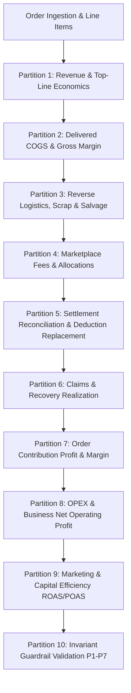

# MarginFlow Financial Logic & Calculation Engine Specification (`logic.md`)

This document specifies the exact mathematical formulas, accounting principles, domain invariants, and procedural order of execution implemented across the **MarginFlow** financial intelligence platform.

All calculations follow Indian E-Commerce GAAP, marketplace settlement standards (Amazon India, Flipkart, Meesho, Myntra, WooCommerce), and GST/TCS/TDS statutory tax isolation protocols.

---

## 1. Execution Order & Pipeline Architecture

The financial calculation pipeline executes in a deterministic 11-stage cascade:



---

## 2. Partition 1: Revenue & Top-Line Economics

Every financial calculation begins with order line items.

### 2.1. Gross Sales (GMV)
Gross Sales is the total invoiced selling price of all ordered products before customer discounts and returns:

$$\text{Gross Sales} = \sum_{i \in \text{Items}} (\text{sellingPrice}_i \times \text{quantity}_i)$$

### 2.2. Order Discounts & Promotions
Discounts applied at the time of checkout (coupons, seller discounts):

$$\text{Total Discounts} = \sum_{i \in \text{Items}} \text{discount}_i$$

### 2.3. Customer Returns & Refund Reversal
When an order experiences a customer return or RTO, the revenue received from the customer is reversed/refunded:

$$\text{Refunded Sales} = \sum_{r \in \text{Returns}} \left( \frac{\text{Order Gross Sales}}{\sum_{i} \text{quantity}_i} \times \text{quantity}_r \right)$$

*For a 100% returned order, $\text{Refunded Sales} = \text{Gross Sales} - \text{Total Discounts}$.*

### 2.4. Net Realized Sales
Net Realized Sales reflects the cash revenue actually retained by the business from non-returned delivered products:

$$\text{Net Sales} = \text{Gross Sales} - \text{Total Discounts} - \text{Refunded Sales}$$

---

## 3. Partition 2: Delivered COGS & Gross Profit

Cost of Goods Sold (COGS) must reflect only goods that remain sold and delivered to end customers, preventing double-charging inventory when returned units are written off or restocked.

### 3.1. Snapshot Unit Cost
To prevent margin distortion caused by future supplier price fluctuations, every order line item immutably locks its cost basis at the time of order creation:

$$\text{Snapshot Unit Cost}_i = \text{product.currentCostPrice at timestamp } T_{\text{order}}$$

### 3.2. Delivered Quantity
The quantity of units actually retained by the customer:

$$\text{Delivered Quantity}_i = \max(0, \, \text{quantity}_i - \text{returnedQuantity}_i)$$

### 3.3. Delivered COGS
Delivered COGS accounts only for products that reached and remained with the customer:

$$\text{Delivered COGS} = \sum_{i \in \text{Items}} (\text{snapshotUnitCost}_i \times \text{Delivered Quantity}_i)$$

### 3.4. Gross Profit & Gross Margin
Gross Profit is the direct product profitability before channel commissions, shipping, and reverse logistics:

$$\text{Gross Profit} = \text{Net Sales} - \text{Delivered COGS}$$

$$\text{Gross Margin \%} = \begin{cases} \left( \frac{\text{Gross Profit}}{\text{Net Sales}} \right) \times 100 & \text{if } \text{Net Sales} > 0 \\ 0\% & \text{if } \text{Net Sales} \le 0 \end{cases}$$

---

## 4. Partition 3: Reverse Logistics, Scrap & Salvage (Loss Engine)

Returns incur shipping charges, operational packaging waste, and product depreciation or total destruction.

### 4.1. Return Condition & Write-Offs
- **`SELLABLE`**: Product is undamaged, repacked, and placed back in sellable inventory. Physical item loss = ₹0.
- **`DAMAGED` / `DEFECTIVE` / `WRONG_ITEM`**: Product cannot be sold as new. The inventory value is written off net of any liquidation/scrap salvage:

$$\text{Damaged Scrap Loss} = \max(0, \, \text{Damage Cost} - \text{Salvage Amount})$$

### 4.2. Return Shipping & Reverse Freight
Marketplaces levy return shipping and handling fees for both Customer Returns and RTOs:

$$\text{Reverse Logistics Fee} = \text{returnShippingCost} + \text{otherReturnCosts}$$

### 4.3. Net Loss Amount (Unified Return Record)
The platform logs an exact pre-computed `lossAmount` per return incident to avoid freight double-counting:

$$\text{lossAmount} = \text{Damaged Scrap Loss} + \text{Reverse Logistics Fee}$$

$$\text{Total Return Loss} = \sum_{r \in \text{Returns}} r.\text{lossAmount}$$

---

## 5. Partition 4: Channel Marketplace Fees & Allocations

### 5.1. Forward Marketplace Deductions (Estimated)
Prior to settlement reconciliation, fees are estimated based on channel rate cards:

$$\text{Forward Fees} = \text{commissionFee} + \text{closingFee} + \text{shippingFee} + \text{pickPackFee} + \text{fixedFee} + \text{technologyFee}$$

### 5.2. Pro-Rata Multi-Item SKU Allocation
When an order contains multiple distinct SKUs, lump-sum marketplace fees and order-level shipping charges must **never** be divided equally. They are allocated strictly pro-rata according to each item's share of order revenue:

$$\text{Item Revenue Share}_i = \frac{\text{sellingPrice}_i \times \text{quantity}_i - \text{discount}_i}{\text{Order Gross Sales} - \text{Order Total Discounts}}$$

$$\text{Allocated Fee}_i = \text{Total Marketplace Fees} \times \text{Item Revenue Share}_i$$

*If the entire order was free (100% discount), allocation falls back to unit quantity share: $\frac{\text{quantity}_i}{\sum_j \text{quantity}_j}$.*

---

## 6. Partition 5: Settlement Reconciliation (The Hybrid Realization Model)

Marketplace reconciliation reconciles estimated fees against bank remittance records without collapsing deductions to zero.

### 6.1. Order Partitioning
Each order is classified as either:
- **`SETTLED`**: A matching settlement record exists (`settlement.orderId === order.id` or `settlement.orderId === order.channelOrderId`).
- **`UNSETTLED`**: Pending payout from the marketplace.

### 6.2. Hybrid Realization Logic
```ts
if (orderIsSettled) {
  // Use audited actual deductions remitted by the marketplace
  totalMarketplaceDeductions = settlement.deductions.reduce((sum, d) => sum + d.amount, 0);
  logisticsCost = settlement.deductions
    .filter(d => d.type === "SHIPPING_FEE" || d.type === "REVERSE_SHIPPING_FEE")
    .reduce((sum, d) => sum + d.amount, 0);
} else {
  // Use forward rate-card estimated fees
  totalMarketplaceDeductions = order.estimatedFees.total;
  logisticsCost = order.estimatedFees.shippingFee;
}
```

### 6.3. Settlement Aging & Overdue Thresholds
Unsettled orders are aged against platform SLAs:
- **Flipkart**: 14 calendar days
- **Meesho**: 7 calendar days
- **Amazon India / Others**: 30 calendar days

$$\text{Days Outstanding} = \frac{\text{Current Date} - \text{Order Date}}{86,400,000 \text{ ms}}$$

$$\text{Overdue Status} = \begin{cases} \text{OVERDUE} & \text{if } \text{Days Outstanding} > \text{SLA Threshold} \\ \text{PENDING} & \text{otherwise} \end{cases}$$

### 6.4. Settlement Discrepancy & Variance
Variance between expected payout and actual remittance:

$$\text{Expected Payout} = \text{Net Sales} - \text{Forward Fees}$$

$$\text{Discrepancy Amount} = \text{Expected Payout} - \text{settlement.netSettlement} - \text{settlement.tcsTdsTax}$$

---

## 7. Partition 6: Claims & Recovery Accounting

When items are lost in transit or returned damaged due to carrier fault, SAFE-T / SPF claims are filed.

### 7.1. Claim Approval & Invariant Ceiling
Total recoveries cannot exceed the financial loss incurred on the order:

$$\text{Recovered Amount} \le \text{Total Return Loss} + \text{Marketplace Overcharges}$$

### 7.2. Net Recovered Claims
Recoveries offset reverse logistics and damage write-offs in the period they are realized:

$$\text{Total Recovered Claims} = \sum_{c \in \text{Approved Claims}} c.\text{amountRecovered}$$

---

## 8. Partition 7: Unit Economics & Contribution Profit

Contribution Profit (Level 1 Profitability) measures direct cash generation per order and per SKU before fixed overheads.

### 8.1. Order Contribution Profit
$$\text{Contribution Profit} = \text{Net Sales} - \text{Delivered COGS} - \text{Marketplace Deductions} - \text{Return Loss} + \text{Claims Recovered}$$

$$\text{Contribution Margin \%} = \begin{cases} \left( \frac{\text{Contribution Profit}}{\text{Net Sales}} \right) \times 100 & \text{if } \text{Net Sales} > 0 \\ 0\% & \text{if } \text{Net Sales} \le 0 \end{cases}$$

---

## 9. Partition 8: Operating Expenses & Company Net Operating Profit

Fixed and variable overheads are aggregated at the business level.

### 9.1. Operating Expenses (OPEX)
Operating expenses include all business operational costs excluding statutory taxes (GST/TCS/TDS):

$$\text{Total OPEX} = \sum_{e \in \text{Expenses}} e.\text{amount}$$

*Expense Categories: `MARKETING_ADS`, `WAREHOUSE_RENT`, `SALARIES`, `SOFTWARE_FEES`, `LOGISTICS`, `OFFICE_SUPPLIES`, `PACKAGING`, `OTHER`.*

### 9.2. Business Net Operating Profit (EBIT)
Net Operating Profit reflects true cash earnings after all channel costs, losses, and business overheads:

$$\text{Net Operating Profit} = \sum_{o \in \text{Orders}} \text{Contribution Profit}_o - \text{Total OPEX}$$

$$\text{Net Profit Margin \%} = \begin{cases} \left( \frac{\text{Net Operating Profit}}{\text{Business Net Sales}} \right) \times 100 & \text{if } \text{Business Net Sales} > 0 \\ 0\% & \text{if } \text{Business Net Sales} \le 0 \end{cases}$$

---

## 10. Partition 9: Marketing & Capital Efficiency Metrics

Evaluates paid user acquisition and advertising performance.

### 10.1. Ad Spend
Advertising expenses are isolated from OPEX using the `MARKETING_ADS` tag:

$$\text{Total Ad Spend} = \sum_{e \in \text{Expenses}, \, e.\text{category} = \text{"MARKETING\_ADS"}} e.\text{amount}$$

### 10.2. Return on Ad Spend (ROAS)
Top-line efficiency per advertising rupee:

$$\text{ROAS} = \begin{cases} \frac{\text{Net Sales}}{\text{Total Ad Spend}} & \text{if } \text{Total Ad Spend} > 0 \\ 0 & \text{if } \text{Total Ad Spend} = 0 \end{cases}$$

### 10.3. Profit on Ad Spend (POAS)
Bottom-line profitability generated per advertising rupee:

$$\text{POAS} = \begin{cases} \frac{\text{Total Contribution Profit}}{\text{Total Ad Spend}} & \text{if } \text{Total Ad Spend} > 0 \\ 0 & \text{if } \text{Total Ad Spend} = 0 \end{cases}$$

---

## 11. Partition 10: System Financial Invariants & Diagnostic Guardrails

The engine validates 7 fundamental accounting invariants across all operations:

| Guardrail ID | Invariant Rule | Violation Condition | Action Taken |
| :--- | :--- | :--- | :--- |
| **P1** | **Cost Basis Immutability** | Order item `snapshotUnitCost <= 0` | Flags missing cost basis; defaults to catalog current cost price. |
| **P2** | **Settlement Isolation** | Unsettled orders using ₹0 deductions | Flags unremitted orders; retains estimated marketplace deductions until verified remittance. |
| **P3** | **Return Quantity Ceiling** | Cumulative returns $> \sum \text{quantity}_i$ | Blocks return logging; enforces $\sum \text{returnedQty} \le \text{orderedQty}$. |
| **P4** | **Claims Recovery Ceiling** | $c.\text{amountRecovered} > \text{Order Loss}$ | Flags claim over-recovery invariant breach. |
| **P5** | **Zero Double-Counting** | Return shipping added to pre-computed loss | Stripped extra shipping addition; uses exact `r.lossAmount`. |
| **P6** | **Tax Isolation** | GST/TCS/TDS mixed into Operating Expenses | Filters out balance sheet tax withholdings from OPEX P&L. |
| **P7** | **Zero-Division Safety** | Division by `netSales = 0` | Guards all margin calculations with ternary checks returning `0%`. |

---

## 12. Partition 11: Inventory & Supplier Ledger Reconciliation

### 12.1. Sellable Return Restocking
When a return record is marked `condition = "SELLABLE"` and `restockStatus = "RESTOCKED"`:
$$\text{product.stockQuantity} \leftarrow \text{product.stockQuantity} + r.\text{quantity}$$

### 12.2. FIFO Supplier Bill Settlement
When a supplier payout is recorded:
1. Increment `supplier.totalPaid` by `paymentAmount`.
2. Iterate over open `PurchaseBill` records for `supplierId` sorted by `invoiceDate` ascending (FIFO):
   - If $\text{remainingPayment} \ge \text{bill.totalAmount}$:
     - $\text{bill.paymentStatus} \leftarrow \text{"PAID"}$
     - $\text{remainingPayment} \leftarrow \text{remainingPayment} - \text{bill.totalAmount}$
   - Else if $\text{remainingPayment} > 0$:
     - $\text{bill.paymentStatus} \leftarrow \text{"PARTIAL"}$
     - $\text{remainingPayment} \leftarrow 0$
3. Write an immutable entry to `FinancialAuditLog`.
