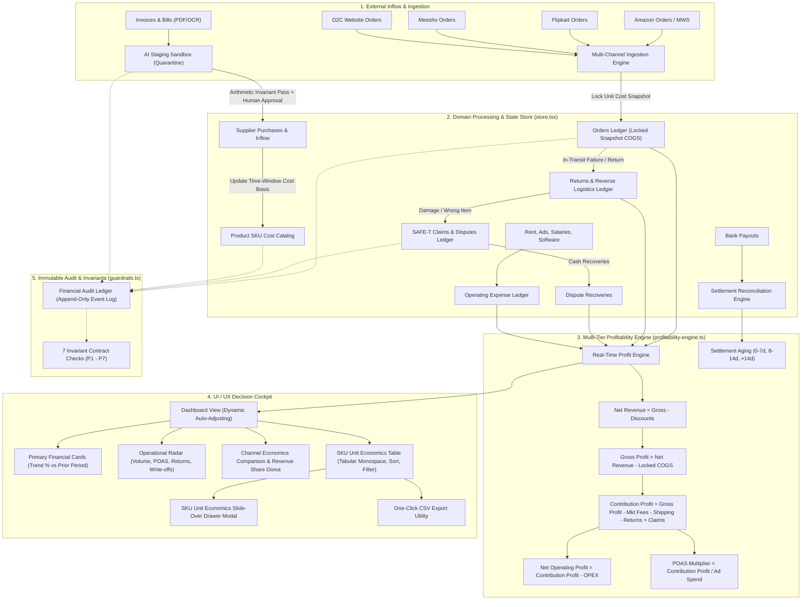

# MarginFlow — System Architecture & Operational Workflow

> **Native System Workflow Specification**  
> **Platform:** MarginFlow (Financial Intelligence Platform)  
> **Last Updated:** 2026-09-16  
> **Reference File:** `workflow.md`

---

## 1. Executive Overview

**MarginFlow** is a transaction-level financial intelligence engine engineered for multi-channel e-commerce sellers operating across **Amazon India**, **Flipkart**, **Meesho**, and **Direct-to-Consumer (D2C Website)**.

### Core Problem Solved
Traditional marketplace dashboards display top-line Gross Merchandise Value (GMV) that masks razor-thin or negative net operating margins. Hidden commissions, non-delivery logistics charges (RTO), damaged customer returns, untracked SAFE-T claims, shifting inventory purchase prices, and un-reconciled payouts systematically drain seller cash flow.

### How MarginFlow Solves It
MarginFlow processes every transaction through **7 segregated domain partitions**, calculates real-time unit economics from gross sales down to net operating profit, enforces deterministic financial guardrails, and stages external documents through a Human-in-the-Loop (HITL) sandbox.

---

## 2. End-to-End Data Flow Architecture



---

## 3. Step-by-Step Lifecycle Workflows

### Phase 1: Order Intake & Locked Snapshot Costing
1. **Order Creation:** When an order is ingested across any channel (`addOrder`), the line item calls the Product Master catalog to retrieve the current unit purchase cost.
2. **Snapshot Invariant (P1):** The engine permanently binds this cost as `snapshotUnitCost` on the order record.
   * *Rationale:* If raw material or supplier wholesale costs increase next month, historical order margins remain historically accurate and immutable.
3. **Idempotency Guard (P2):** Every order is checked against `marketplace:channelOrderId` to prevent duplicate ledger postings.

### Phase 2: Order Lifecycle Transitions
Orders advance through deterministic status states:
```
[CONFIRMED] ➔ [SHIPPED] ➔ [DELIVERED]
      │           │
      │           └──➔ [RTO] (Failed delivery in-transit)
      │
      └──➔ [CANCELLED]
```
Delivered orders can subsequently transition to:
* `RETURNED`: Customer returned the complete order.
* `PARTIALLY_RETURNED`: Specific line items returned; others retained by customer.

### Phase 3: Returns, RTO & Reverse Logistics Valuation
1. **Return Nature Classification:**
   * `CUSTOMER_RETURN`: Return initiated after physical delivery.
   * `RTO (Return to Origin)`: Customer refused delivery or courier failed transit.
   * `DAMAGED_RETURN`: Product arrived back broken or unsellable.
   * `LOST_RETURN`: Courier lost return shipment in transit.
2. **Physical Inspection & Salvage:**
   * Items are inspected and assigned a condition: `SELLABLE`, `DAMAGED`, `USED`, `MISSING`, `UNUSABLE`, or `UNDER_INSPECTION`.
3. **Net Loss Calculation:**
   $$\text{Net Return Loss} = \text{Forward Freight Loss} + \text{Reverse Courier Surcharge} + \text{Damaged Inventory Write-off} - \text{Scrap Salvage Value}$$

### Phase 4: SAFE-T Claims & Dispute Recoveries
1. **Claim Escalation:** For damaged returns, missing contents, or weight discrepancies, an incident is registered in the Claims Ledger (`addClaim`).
2. **Dispute Lifecycle:**
   ```
   [FILED] ➔ [UNDER_REVIEW] ➔ [APPROVED] ➔ [RECOVERED]
                                    │
                                    └──➔ [REJECTED]
   ```
3. **Recovery Ceiling Invariant (P5):** The engine guarantees $\text{Amount Recovered} \le \text{Amount Claimed}$.
4. **Contribution Credit:** Recovered funds are directly credited back into the business and channel Contribution Profit.

### Phase 5: Marketplace Settlement & Cash Aging Reconciliation
1. **Settlement Batch Verification (P4):**
   $$\text{Gross Order Sales} - \text{Marketplace Deductions} - \text{TCS/TDS} \equiv \text{Net Bank Deposit}$$
   Batches that match are marked `RECONCILED`; any variance triggers `MISMATCH_FLAGGED`.
2. **Forensic Settlement Aging Brackets:**
   Un-disbursed funds are categorized into aging cohorts to detect delayed cash:
   * **0–7 Days:** *Cycle Safe* (Normal settlement clearance window).
   * **8–14 Days:** *Approaching Threshold* (Requires monitoring).
   * **> 14 Days:** *Delayed / Overdue* (Triggers overdue transaction table inspection).

### Phase 6: Document Upload, Bill OCR Pipeline & AI Staging Sandbox (HITL)
1. **File Ingestion & Directory Persistence:**
   * Users upload invoices, bills, and settlement PDFs/images via the drag-and-drop modal.
   * Files are sent to `/api/upload-bill` and permanently saved to the project directory: `public/uploads/bills/{timestamp}-{sanitizedFilename}`.
2. **OCR & Intelligent Document Processing (IDP):**
   * The OCR engine (`src/domain/ocr-engine.ts`) scans the document text to extract: Marketplace/Vendor, Invoice Number, Order/Bill Date, SKU, Product Name, Quantity, Unit Price, Tax/GST, and Grand Total.
   * If uploaded files lack text layers, fallback OCR mock tokenization and 1-click sample builders generate accurate document representations.
3. **Quarantine State & Zero Direct Ledger Writes:**
   * Ingested documents enter `STAGED_NEEDS_REVIEW`. Raw AI outputs cannot write directly into financial ledgers.
4. **Arithmetic Invariant Check (P7):**
   $$\text{Quantity} \times \text{Unit Price} - \text{Discount} + \text{Tax} \equiv \text{Total Amount} \quad (\pm ₹0.05 \text{ tolerance})$$
   Mathematical discrepancies trigger red warning banners for human operator correction.
5. **Field Provenance:** Tracks whether values are `AI_EXTRACTED`, `MANUALLY_ENTERED`, or `MANUALLY_MODIFIED`.
6. **Approval & Ledger Posting:**
   * Once approved by an operator (`approveStagedDocument`):
     * `SUPPLIER_BILL` documents update the master catalog `unitCost` for matching SKUs.
     * `INVOICE` documents generate production order entries.
     * An immutable audit record is committed to the Financial Audit Ledger (`entityType: "DOCUMENT"` and `"PURCHASE"` / `"ORDER"`).

### Phase 7: Operating Expenses & Tax Isolation
1. **OPEX Ledger:** Tracks indirect overhead across Advertising, Salaries, Software, Warehouse Rent, Packaging, Office, and Logistics.
2. **Tax Isolation Guard (P6):** TCS, TDS, and GST collections are segregated as balance sheet liabilities and barred from diluting Operating Expenses or Contribution Margin.

---

## 4. Multi-Tier Profitability Calculation Formulae

The core mathematical engine (`src/domain/profitability-engine.ts`) runs in real time at Global, Channel, and SKU levels:

$$\begin{aligned}
\mathbf{Net\ Revenue} &= \text{Gross Sales} - \text{Customer Discounts} \\
\mathbf{Gross\ Profit} &= \text{Net Revenue} - \text{COGS (Snapshot Basis)} \\
\mathbf{Gross\ Margin\ \%} &= \frac{\text{Gross Profit}}{\text{Net Revenue}} \times 100 \\
\mathbf{Contribution\ Profit} &= \text{Gross Profit} - \text{Marketplace Commissions} - \text{Logistics Fees} \\
&\quad - (\text{Return Losses} + \text{RTO Losses}) + \text{Dispute Recoveries} \\
\mathbf{Contribution\ Margin\ \%} &= \frac{\text{Contribution Profit}}{\text{Net Revenue}} \times 100 \\
\mathbf{Net\ Operating\ Profit} &= \text{Contribution Profit} - \text{Operating Expenses (OPEX)} \\
\mathbf{Net\ Operating\ Margin\ \%} &= \frac{\text{Net Operating Profit}}{\text{Net Revenue}} \times 100 \\
\mathbf{POAS\ Multiplier} &= \frac{\text{Contribution Profit}}{\text{Total Ad Spend}}
\end{aligned}$$

---

## 5. UI / UX Design & Responsive Cockpit Workflow

### Workspace Shell & Collapsible Icon Rail
* **Expanded State (`w-64`):** Full brand header (`MarginFlow`), module labels, pending document badges, and workspace collapse toggle.
* **Minimized Icon Rail (`w-[72px]`):** Keeps the **MF** logo centered and visible at the top. Text labels are hidden; icons display native tooltips (`title="..."`) and status notification dots.
* **Keyboard Shortcut:** `Ctrl + B` (or `Cmd + B`) toggles between expanded and icon-rail modes.
* **Fluid Screen Auto-Adjustment:** Main container uses `w-full max-w-[1536px] min-w-0 mx-auto` with window resize event dispatchers, ensuring charts and tables seamlessly scale without clipping or horizontal overflow.

### Interactive Dashboard Cockpit
1. **Date-Range Presets:** Instant filtering across `All Time`, `Today`, `Last 7 Days`, `Last 30 Days`, `This Month`, and `Last Month` with period-over-period percentage trend indicators.
2. **Click-to-Drilldown Operational Cards:**
   * Clicking **Volume** sorts SKUs by unit sales.
   * Clicking **Returns & RTO** sorts SKUs by return rate descending.
   * Clicking **POAS / Ads** navigates directly to ad spend efficiency.
3. **Loss-Making SKU Advisory:** Dynamic banner highlighting negative-margin SKUs; clicking a product chip filters the SKU table to that specific item.
4. **SKU Unit Economics Table:**
   * Formatted with `tabular-nums font-mono` for decimal vertical alignment.
   * Instant search, column-level sort, and quick filter pills (`All`, `Profitable`, `Loss-Making`).
   * **Export CSV:** Downloads complete SKU profitability metrics in one click.
5. **SKU Slide-Over Drawer Modal:** Clicking any table row slides in an inspection drawer showing a granular per-unit cost step-down waterfall (`ASP ➔ COGS ➔ Fees ➔ Reverse Logistics Drag ➔ Net Profit`).

---

## 6. Immutable Financial Audit Ledger

Every modifying state action records an event into the append-only audit log:
* `entityType`: `ORDER`, `CLAIM`, `PRODUCT`, `PURCHASE`, `EXPENSE`, `DOCUMENT`
* `entityId`: Unique resource identifier
* `fieldName`: Specific attribute modified (e.g., `status`, `unitCost`, `amountRecovered`)
* `oldValue` & `newValue`: Prior and updated values
* `modifiedBy`: User identity or automated system process
* `timestamp`: ISO-8601 execution timestamp

---

## 7. Operational Guardrail Invariants Summary

| Code | Guardrail Name | Invariant Formula | Enforcement Level |
| :--- | :--- | :--- | :--- |
| **P1** | Cost Snapshot Integrity | $\text{snapshotUnitCost} > 0$ on all items | Hard Blocker |
| **P2** | Ingestion Idempotency | $\text{Unique}(\text{marketplace} : \text{channelOrderId})$ | Dedup Drop |
| **P3** | Return Quantity Ceiling | $\sum \text{Returned} \le \sum \text{Ordered}$ | Validation Error |
| **P4** | Settlement Balance | $\text{Gross} - \text{Fees} - \text{Taxes} \equiv \text{Net Bank Deposit}$ | Flag Mismatch |
| **P5** | Claim Recovery Ceiling | $\text{Amount Recovered} \le \text{Amount Claimed}$ | Hard Cap |
| **P6** | Tax Liability Isolation | $\text{TCS} + \text{TDS} + \text{GST} \notin \text{OPEX}$ | Balance Sheet |
| **P7** | AI Extraction Guard | $\text{Qty} \times \text{Price} - \text{Disc} + \text{Tax} \equiv \text{Total}$ | Quarantine Review |
